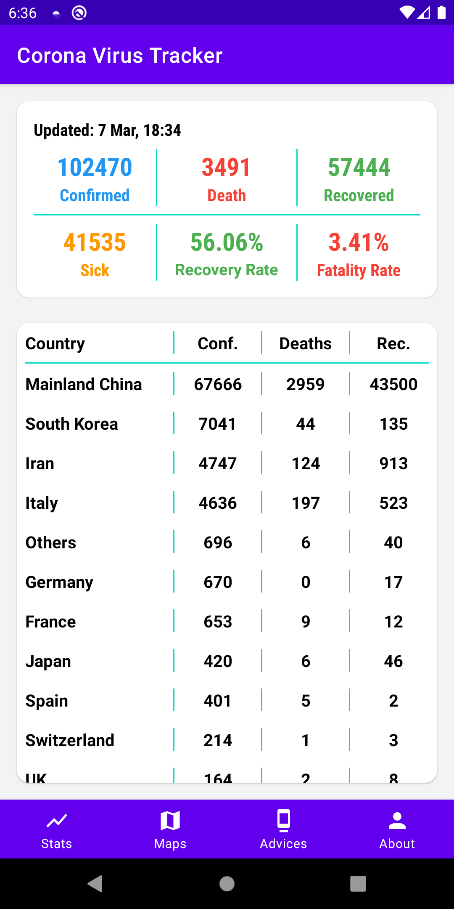
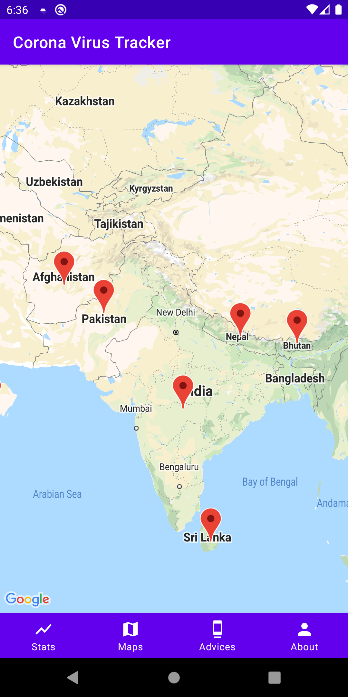
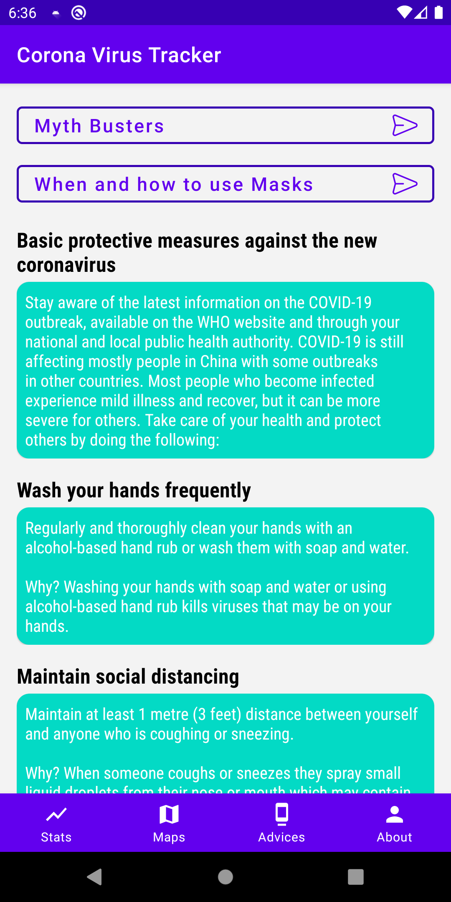
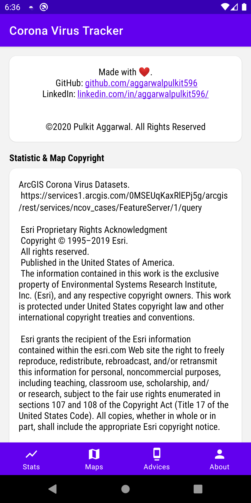

# Corona Virus Tracker & Advices Android App with Kotlin
Application is available here:

## Screenshots
<table>
        <tr>
            <td></td>
            <td></td>
        </tr>
        <tr>
            <td></td>
            <td></td>
        </tr>
</table>

## Features
- Current statistics of global total confirmed, deaths, recovered cases.
- Statistics of countries and regions total cases count
- World map with annotation pin and description of affected regions
- Datasets is provided by ArcGIS Esri Corona Virus dataset.
- Basic advice to prevent and handle virus,  myth busters Q&A from WHO.

## Requirements
- Android Studio 3.6

## Getting Started
- Clone or download
- Build and Run
